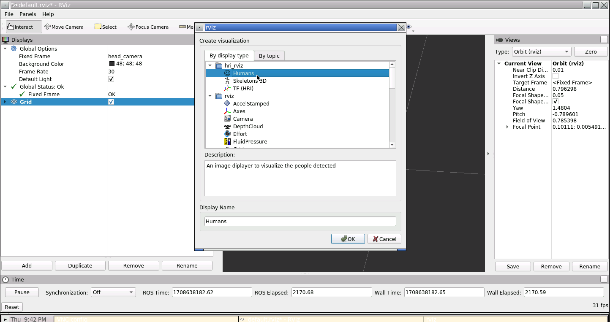
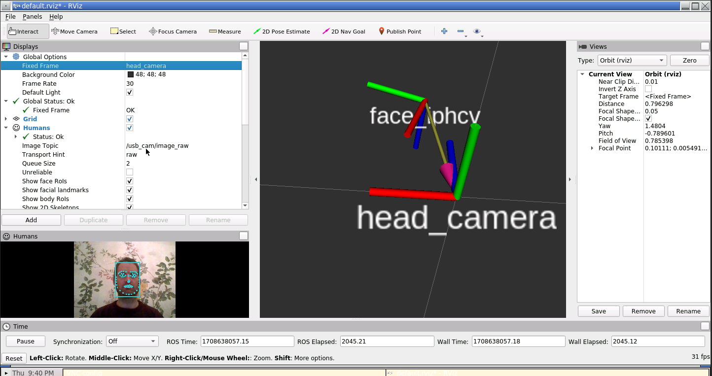
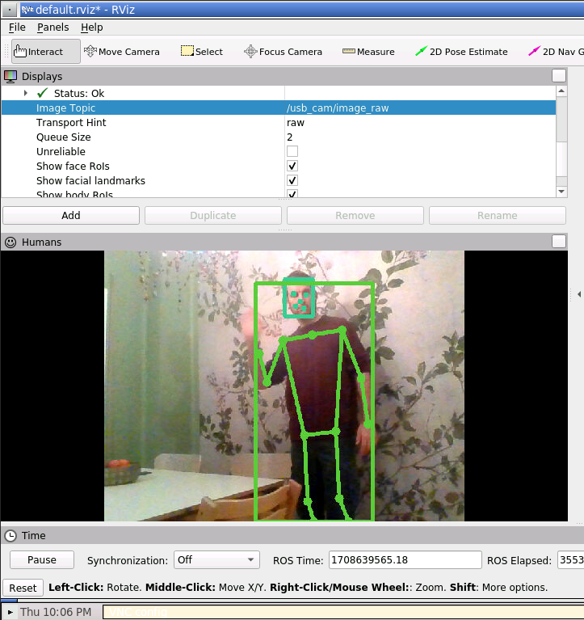
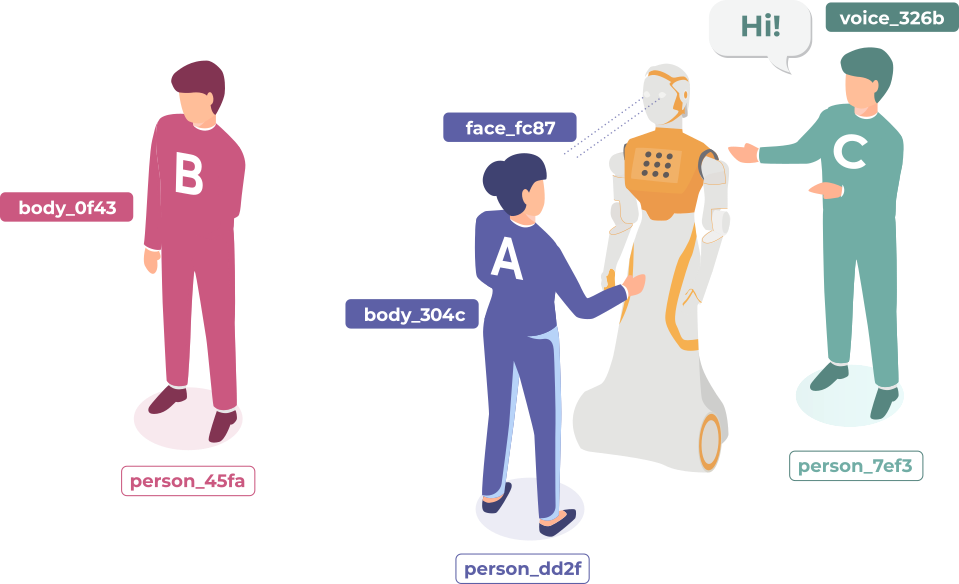
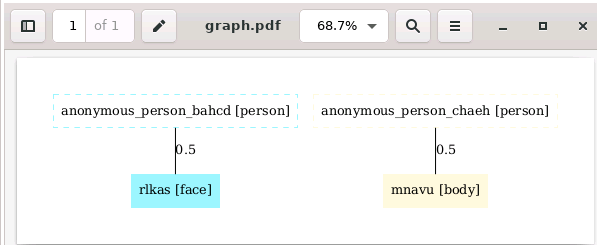
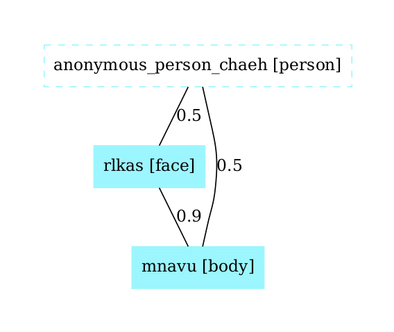
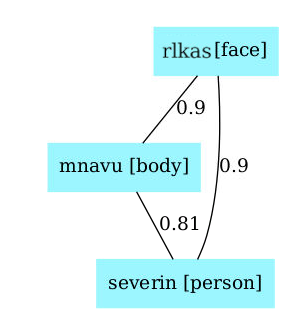
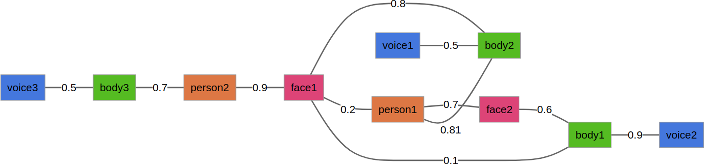

# ROS4HRI tutorials

Welcome to the ROS2 humble tutorial for the ROS4HRI [framework](https://wiki.ros.org/hri). This tutorial walks you through the basics for setting up a person identification pipeline that can be used for. Using this information, you'll be able to perform different human-robot interactions. All the nodes used in the tutorial are [REP-155](https://www.ros.org/reps/rep-0155.html) compliant. 

## HRI packages

We are gonna using a docker with the following packages and their dependecies already installed: 

* [hri_face_detect](https://github.com/ros4hri/hri_face_detect)
* [hri_face_identification]([https://gitlab/ros4hri/hri_face_identification](https://github.com/ros4hri/hri_face_identification))
* [hri_body_detect](https://github.com/ros4hri/hri_body_detect)
* [hri_face_body_matcher](https://github.com/ros4hri/hri_face_body_matcher)
* [hri_person_manager](https://github.com/ros4hri/hri_person_manager)
* [hri_rviz](https://github.com/ros4hri/hri_rviz)


## Prepare the environment

### Initial environment preparation

We'll use docker compose to launch a tutorial docker container based on this image (link). The image is based on ROS 2 humble and comes with all the necessary deps installed! 

```bash
xhost +local:docker
sudo apt install docker-compose
git clone https://github.com/OscarMrZ/ros4hri-tutorials.git -b humble-devel
cd ros4hri-tutorials
docker compose up
```

We will work with different terminal windows. To connect to the running docker simply execute the following command in each of them. 

```
docker exec -it ws_container bash
```

## Face detection

### Start the usb_cam node

This node simply reads the input from the webcam and the [camera intrinsics](config/default_webcam_calibration.yml) and publishes the images under `image_raw` and the camera parameters under `camera_info`. 

```bash
ros2 run usb_cam usb_cam_node_exe
```

### Start the face detection node

The [`hri_face_detect`](https://github.com/ros4hri/hri_face_detect) package performs fast face detection using YuNet face detector and Mediapipe Face Mesh. This node publishes under the `/humans/faces/<faceID>/` topic different info about the detected face, such as the ROI.
Also, it will publish the list of tracked faces be published under the `/humans/faces/tracked`

Importantly, this ID is not persistent: once a face is lost (for instance, the person goes out of frame), its ID is not valid nor meaningful anymore. To cater for a broad range of applications (where re-identification might not be always necessary), there is no expectation that the face detector will attempt to recognise the face and re-assign the same face ID if the person reappears.

There is a one-to-one relationship between this face ID and the estimated 6D pose of the head. The node publishes a head pose estimation with a TF frame named `face_<faceID>`. 

Let's start the face detection node: 

```bash
ros2 launch hri_face_detect face_detect.launch.py
```

You should immediately see on the console that some faces are indeed detected. Let's visualise them.

#### Visualise the result

We can check that the faces are detected and published at ROS message by simply typing:

```
ros2 topic echo /humans/faces/tracked
```

We can also use `rviz2` to display the faces with the facial landmarks.
Then, in `rviz2`, set the fixed frame to `head_camera`, and enable the `Humans` and TF plugins:



Configure the `Humans` plugin to use the `/image_raw` topic. You should see the face being displayed with the landmarks. Also, set up the `TF` plugin in order to see the face position in 3D. 



We are effectively running the face detector, extracting features and 3D position in a Docker container, no GPU needed! 

## Body detection

First, open yet another terminal connected to the docker. 

### Start the body detection

Start the body detector:

```bash
ros2 launch hri_body_detect hri_body_detect_with_args.launch.py use_depth:=False
```
In `rviz` you should now see the skeleton being detected, in addition to the face:



## Assembling full persons

Now that we have a face and a body, we can build a 'full' person.



Until now, we were running two ROS4HRI perception module: `hri_face_detect` and
`hri_body_detect`.

The face detector is assigning a unique identifier to each face that it
detects (and since it only *detects* faces, but does not *recognise* them, a
new identifier might get assigned to the same actual face if it disappears and
reappears later); the body detector is doing the same thing for bodies.

Next, we are going to run a node dedicated to managing full *persons*. Persons
are also assigned an identifier, but the person identifier is meant to be permanent. 

```bash
ros2 launch hri_person_manager person_manager.launch.py robot_reference_frame:=default_cam
```

If the face and body detector are still running, you might see that
`hri_person_manager` is already creating some *anonymous* persons: the node
knows that some persons must exist (since faces and bodies are detected), but it
does not know *who* these persons are. 

### Display the person feature graph

We can use a small utility tool to display what the person manager understand of
the current situation.

In a different terminal, run:

```
ros2 run hri_person_manager show_humans_graph
evince /tmp/graph.pdf
```

You should see a graph similar to:



Note that the person manager will generate as many anonymous people as new faces and bodies.

### Connecting the person feature graph

First, let's manually tell `hri_person_manager` that the face and body are
indeed parts of the same person. TO do so, we need to publish a *match* between
the two ids (in this example, `rlkas` (the face) and `mnavu` (the body), but
your IDs might be different, as they are randomly chosen).

In a new terminal (with ROS sourced):

```
ros2 topic pub /humans/candidate_matches hri_msgs/IdsMatch "{id1: 'rlkas', id1_type: 2, id2: 'mnavu', id2_type: 3, confidence: 0.9}"
```

The graph updates to:



> ⚠️  do not forget to change the face and body IDs to match the ones in your system!

> 💡 the values `2` and `3` correspond respectively to a face and a body. See
> [hri_msgs/IdsMatch](https://github.com/ros4hri/hri_msgs/blob/master/msg/IdsMatch.msg) for the list of constants.

### Manually identifying the person

To turn our *anonymous* person into a known person, we need to match the face ID
(or the body ID) to a person ID:

For instance:

```
ros2 topic pub /humans/candidate_matches hri_msgs/IdsMatch "{id1: 'rlkas', id1_type: 2, id2: 'severin', id2_type: 1, confidence: 0.9}"
```

The graph updates to:



Now that the person is 'known' (that is, at least one person 'part' is associated to
a person ID) the automatically-generated 'anonymous' person is replaced by the
actual person. Note that we only need to id one person part to start connecting the graph, but we could have multiple ids (face, body or even voice)

We are doing it manually here, but in practice, we want to do it automatically.

### Running automatic face identification

To get 'real' people, we need a node able to match for instance a *face* to a unique and
stable *person*: a face identification node. Luckily, we have one of those in the docker: `hri_face_identification`, a ROS4HRI identification module. This node will publish candidates between a `faceID` and a `personID` for us. Importantly, this node won't manage assembling the person, it only publishes matches. It will be the task of the person manager to assemble the person feature graph, as we tested manually. 

```
ros2 launch hri_face_identification face_identification_with_args.launch.py
```

### Running automatic face and body matching

In the same way that `hri_face_identification` automatically publishes matches between a face and a person, we have available another identification node, called `hri_face_body_matcher`, that publishes possible matches between given face and a body. This will allow us to fully connect a person with its face and body.

Note that in this case, no connection is directly created with the person, as this node matches bodies and faces, not bodies and person. 

```
ros2 launch hri_face_body_matcher hri_face_body_matcher.launch.py
```

### Probabilistic feature matching

The algorithm used by `hri_person_manager` exploits the probabilities of *match*
between each and all personal features perceived by the robot to find the most
likely set of *partitions* of features into persons.

For instance, from the following graph, try to guess which are the most likely
'person' associations:



Response in the paper (along with the exact algorithm!): [the 'Mr Potato' paper](https://academia.skadge.org/publis/lemaignan2024probabilistic.pdf).

## Setting up some interactions

Now we have information to properly identify individual people, let's use it to do some HRIs using a the `expressive_eyes` package, which simulates the head of a Tiago Pro:

1. Store and recognize the first person that is identified. The robot will only interact with this person, from now on, the target, ignoring the rest. Here you have an starting point. 
2. Show a positive [expression](https://github.com/ros4hri/hri_msgs/blob/master/msg/Expression.msg) when the person in from of the robot is the target and a sad emotion otherwise. 
3. Follow 

## Additional info

You may check the [`pyhri` API documentation](https://pyhri.readthedocs.io/en/latest/)here, and the [C++ `libhri` API documentation](http://docs.ros.org/en/noetic/api/hri/html/c++/) here.
